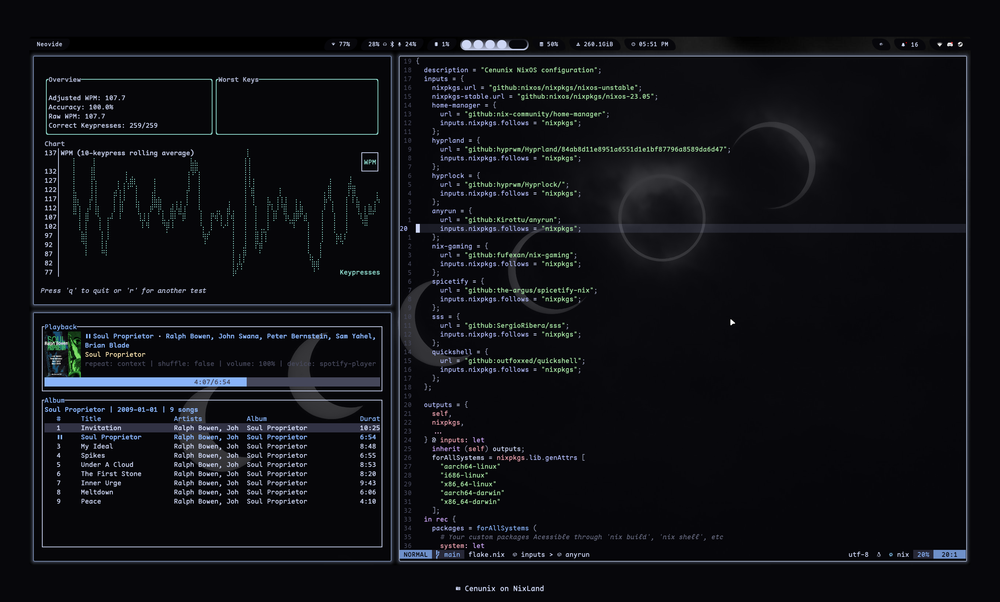

<h1 align="center">
    

死地 NixLand  

 

   

   
     
    
   
    

</h1>

<b>NixOS Configuration for Multi-System Management</b>

## Overview

- **Home-Manager** - Manages Home Directory Configuration, mostly (dot)files
- **Modules** - Curate Options Per System, Reduce Reduntant Code and Switch
  Program Defaults
- **Flake** - Easily Lock Versions of Inputs and Maintain the Reproducible
  Nature of NixOS
- **Editor** - Simple and Efficient Neovim Configuration Using Nvf to Leverage Nix and Neovim
- **Theming** - Dark Catppuccin Palette For Maximum Reddit Upvotes
- **Other Software**
  - **Browser**: Firefox
  - **File-Manager**: Lf/Thunar
  - **Terminal**: Kitty/Foot
  - **Launcher**: Anyrun
  - **Bar**: Hyprpanel

## Desktop preview

Show

  

<!-- CONTACT -->

## Contact

 <a href="https://bsky.app/profile/cenunix.bsky.social">
   <picture>
  
     </picture>
</a>
  
 <a href="https://mastodon.social/@cenunix">
   <picture>
  
   </picture>
 </a>
  
  <a href="https://discourse.nixos.org/u/cenunix/summary">
   <picture>
  
   </picture>
 </a>

<!-- ACKNOWLEDGMENTS -->

(<a href="#readme-top">back to top</a>)

<!-- MARKDOWN LINKS & IMAGES -->
<!-- https://www.markdownguide.org/basic-syntax/#reference-style-links -->

[contributors-shield]: https://img.shields.io/github/contributors/othneildrew/Best-README-Template.svg?style=for-the-badge
[contributors-url]: https://github.com/othneildrew/Best-README-Template/graphs/contributors
[forks-shield]: https://img.shields.io/github/forks/othneildrew/Best-README-Template.svg?style=for-the-badge
[forks-url]: https://github.com/othneildrew/Best-README-Template/network/members
[stars-shield]: https://img.shields.io/github/stars/othneildrew/Best-README-Template.svg?style=for-the-badge
[stars-url]: https://github.com/othneildrew/Best-README-Template/stargazers
[issues-shield]: https://img.shields.io/github/issues/othneildrew/Best-README-Template.svg?style=for-the-badge
[issues-url]: https://github.com/othneildrew/Best-README-Template/issues
[license-shield]: https://img.shields.io/github/license/othneildrew/Best-README-Template.svg?style=for-the-badge
[license-url]: https://github.com/othneildrew/Best-README-Template/blob/master/LICENSE.txt
